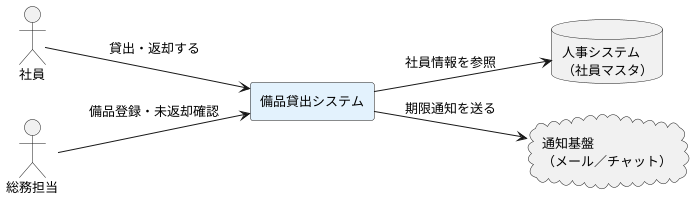
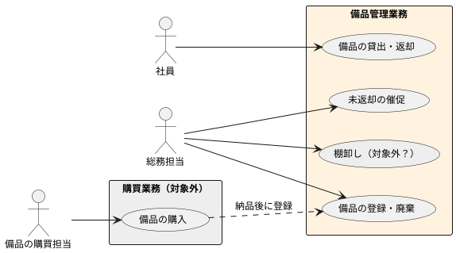

## システムの境界

中に入れるもの／入れないものを最初に合意する。外部との接続方式はここでは決めない。

```plantuml システムの境界
@startuml
left to right direction
skinparam defaultFontSize 13
actor 社員
actor 総務担当
rectangle "備品貸出システム" as sys #E3F2FD
database "人事システム\n（社員マスタ）" as hr
cloud "通知基盤\n（メール／チャット）" as notify
社員 --> sys : 貸出・返却する
総務担当 --> sys : 備品登録・未返却確認
sys --> hr : 社員情報を参照
sys --> notify : 期限通知を送る
@enduml
```

## 対象業務

要求を満たす仕事があるか。対象外は灰色。

```plantuml 対象業務
@startuml
left to right direction
skinparam defaultFontSize 12
actor 社員
actor 総務担当
actor "備品の購買担当" as buyer
rectangle "備品管理業務" #FFF3E0 {
  usecase "備品の貸出・返却" as b1
  usecase "備品の登録・廃棄" as b2
  usecase "未返却の催促" as b3
  usecase "棚卸し（対象外？）" as b4 #EEEEEE
}
rectangle "購買業務（対象外）" #EEEEEE {
  usecase "備品の購入" as p1
}
社員 --> b1
総務担当 --> b2
総務担当 --> b3
総務担当 --> b4
buyer --> p1
p1 ..> b2 : 納品後に登録
@enduml
```
