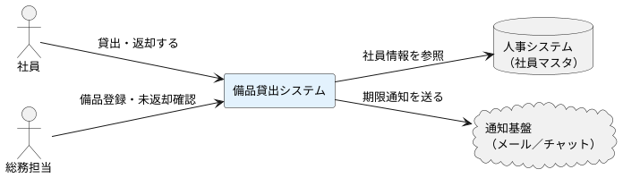

中に入れるもの／入れないものを最初に合意する。外部との接続方式はここでは決めない。

```plantuml システムの境界
@startuml
left to right direction
skinparam defaultFontSize 13
actor 社員
actor 総務担当
rectangle "備品貸出システム" as sys #E3F2FD
database "人事システム\n（社員マスタ）" as hr
cloud "通知基盤\n（メール／チャット）" as notify
社員 --> sys : 貸出・返却する
総務担当 --> sys : 備品登録・未返却確認
sys --> hr : 社員情報を参照
sys --> notify : 期限通知を送る
@enduml
```
