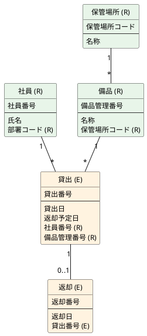

認知番号（識別子）を持つものを残す。資源（R）は継続して存在する物、出来事（E）は一度きりの事実。

- 上段が識別子、下段が属性。資源の識別子が出来事に置かれる。
- 情報の「備品種類」は、種類コードが確認できるまで備品の属性に留める。
- 情報の「通知」は催促の再送。通知番号を採番しなければ残さない。状態変化は貸出／返却で足りる。

## 表

### 社員（R）

| 列 | 型 | 備考 |
|---|---|---|
| 社員番号 | 文字列 | 識別子。人事システム由来 |
| 氏名 | 文字列 | |
| 部署コード | 文字列 | 資源「部署」の識別子（未確認） |

### 備品（R）

| 列 | 型 | 備考 |
|---|---|---|
| 備品管理番号 | 文字列 | 識別子。**存在するか要確認** |
| 名称 | 文字列 | |
| 保管場所コード | 文字列 | 資源「保管場所」の識別子 |

### 貸出（E）

| 列 | 型 | 備考 |
|---|---|---|
| 貸出番号 | 文字列 | 識別子。システム採番 |
| 貸出日 | 日付 | |
| 返却予定日 | 日付 | 既定 = 貸出日 + 7 |
| 社員番号 | 文字列 | 資源の識別子 |
| 備品管理番号 | 文字列 | 資源の識別子 |

### 返却（E）

| 列 | 型 | 備考 |
|---|---|---|
| 返却番号 | 文字列 | 識別子。システム採番 |
| 返却日 | 日付 | |
| 貸出番号 | 文字列 | 先行する出来事の識別子 |
