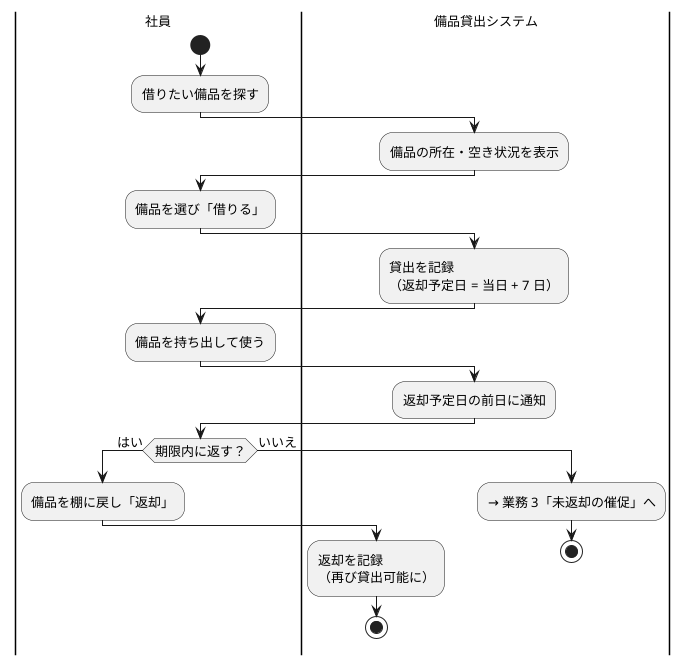

```plantuml 貸出・返却（To-Be）
@startuml
skinparam defaultFontSize 13
|社員|
start
:借りたい備品を探す;
|備品貸出システム|
:備品の所在・空き状況を表示;
|社員|
:備品を選び「借りる」;
|備品貸出システム|
:貸出を記録\n（返却予定日 = 当日 + 7 日）;
|社員|
:備品を持ち出して使う;
|備品貸出システム|
:返却予定日の前日に通知;
|社員|
if (期限内に返す？) then (はい)
  :備品を棚に戻し「返却」;
  |備品貸出システム|
  :返却を記録\n（再び貸出可能に）;
  stop
else (いいえ)
  :→ 業務 3「未返却の催促」へ;
  stop
endif
@enduml
```

- システムとの接点は「借りる」「返却」の 2 つ。ユースケース「備品を借りる」「備品を返す」になる。
- 承認を入れる場合は「借りる」と「貸出を記録」の間に総務担当のレーンが増える。
