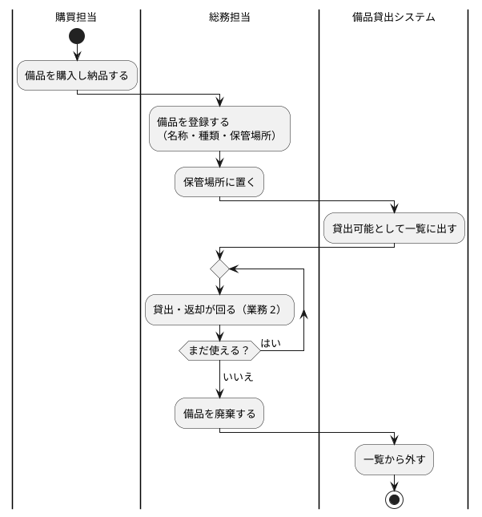

```plantuml 備品の管理（To-Be）
@startuml
skinparam defaultFontSize 13
|購買担当|
start
:備品を購入し納品する;
|総務担当|
:備品を登録する\n（名称・種類・保管場所）;
:保管場所に置く;
|備品貸出システム|
:貸出可能として一覧に出す;
|総務担当|
repeat
  :貸出・返却が回る（業務 2）;
repeat while (まだ使える？) is (はい)
->いいえ;
:備品を廃棄する;
|備品貸出システム|
:一覧から外す;
stop
@enduml
```

- 棚卸し（年 1 回、実地確認）を入れるなら、「貸出中一覧」と「保管場所」を照合する仕事がここに足される。
- 「登録」がシステムとの接点。ユースケース「備品を登録する」になる。
