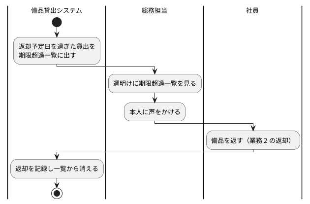

```plantuml 未返却の催促（To-Be）
@startuml
skinparam defaultFontSize 13
|備品貸出システム|
start
:返却予定日を過ぎた貸出を\n期限超過一覧に出す;
|総務担当|
:週明けに期限超過一覧を見る;
:本人に声をかける;
|社員|
:備品を返す（業務 2 の返却）;
|備品貸出システム|
:返却を記録し一覧から消える;
stop
@enduml
```

- システムとの接点は「期限超過一覧を見る」。ユースケースになる。
- 価値のストーリー「月曜朝の未返却確認」がこの業務そのもの。
