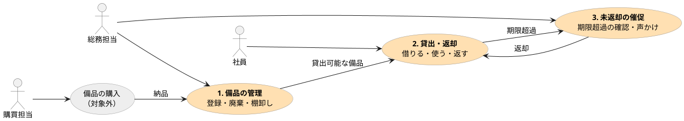

業務（橙）をつなぐ矢印が回る順番。灰色は今回の対象外。各業務をクリックすると個別のページへ。

| 業務 | 担当 | 起きるタイミング | ページ |
|---|---|---|---|
| 1. 備品の管理 | 総務担当 | 納品時・廃棄時・年 1 回の棚卸し | [備品の管理](/docs/flow-manage) |
| 2. 貸出・返却 | 社員 | 日常。返却で備品は再び貸出可能に戻る | [貸出・返却](/docs/flow-lend) |
| 3. 未返却の催促 | 総務担当 | 返却予定日を過ぎたとき（週明けにまとめて） | [未返却の催促](/docs/flow-remind) |

価値のストーリー「月曜朝の未返却確認」は 3 に対応する。
