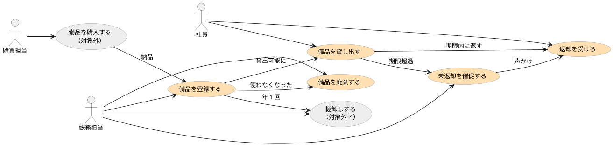

業務（橙）をつなぐ矢印が、仕事の順番。灰色は今回の対象外。

```plantuml 業務の全体像
@startuml
left to right direction
skinparam defaultFontSize 13
skinparam usecaseBorderColor #999
skinparam actorBorderColor #555
skinparam nodesep 20
skinparam ranksep 60

actor 購買担当 as buyer
actor 総務担当 as admin
actor 社員 as emp

usecase "備品を購入する\n（対象外）" as p0 #EEEEEE
usecase "備品を登録する" as b1 #FFE0B2
usecase "備品を貸し出す" as b2 #FFE0B2
usecase "返却を受ける" as b3 #FFE0B2
usecase "未返却を催促する" as b4 #FFE0B2
usecase "備品を廃棄する" as b5 #FFE0B2
usecase "棚卸しする\n（対象外？）" as b6 #EEEEEE

p0 --> b1 : 納品
b1 --> b2 : 貸出可能に
b2 --> b3 : 期限内に返す
b2 --> b4 : 期限超過
b4 --> b3 : 声かけ
b1 --> b5 : 使わなくなった
b1 --> b6 : 年 1 回

buyer --> p0
admin --> b1
admin --> b4
admin --> b5
admin --> b6
emp --> b2
emp --> b3
@enduml
```

- 返却を受けたら、その備品はまた「貸し出す」に戻る（繰り返し）。
- 価値のストーリー「月曜朝の未返却確認」は「未返却を催促する」に対応する。
- 各業務の中の手順（画面と情報のやりとり）はユースケースに書く。
