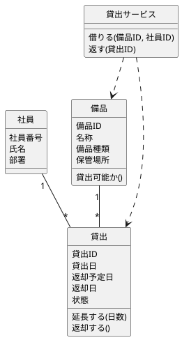

```plantuml クラス図
@startuml
skinparam defaultFontSize 12
hide circle
class 備品 {
  備品ID
  名称
  備品種類
  保管場所
  貸出可能か()
}
class 社員 {
  社員番号
  氏名
  部署
}
class 貸出 {
  貸出ID
  貸出日
  返却予定日
  返却日
  状態
  延長する(日数)
  返却する()
}
class 貸出サービス {
  借りる(備品ID, 社員ID)
  返す(貸出ID)
}
備品 "1" -- "*" 貸出
社員 "1" -- "*" 貸出
貸出サービス ..> 貸出
貸出サービス ..> 備品
@enduml
```
