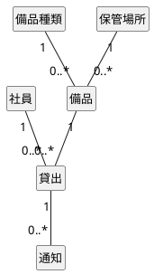

情報モデルと同じ名詞（備品・備品種類・保管場所・社員・貸出・通知）。関係を変えるときは情報モデルへ戻す。

```plantuml ドメインモデル
@startuml
hide circle
hide members
skinparam defaultFontSize 13
class 備品
class 備品種類
class 保管場所
class 社員
class 貸出
class 通知
備品種類 "1" -- "0..*" 備品
保管場所 "1" -- "0..*" 備品
備品 "1" -- "0..*" 貸出
社員 "1" -- "0..*" 貸出
貸出 "1" -- "0..*" 通知
@enduml
```
