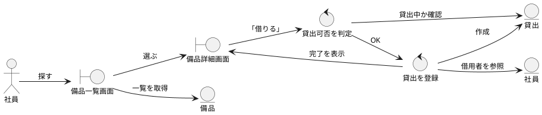

```plantuml ロバストネス図
@startuml
left to right direction
skinparam defaultFontSize 12
actor 社員
boundary 備品一覧画面
boundary 備品詳細画面
control 貸出可否を判定
control 貸出を登録
entity 備品
entity 貸出
entity 社員 as emp
社員 --> 備品一覧画面 : 探す
備品一覧画面 --> 備品 : 一覧を取得
備品一覧画面 --> 備品詳細画面 : 選ぶ
備品詳細画面 --> 貸出可否を判定 : 「借りる」
貸出可否を判定 --> 貸出 : 貸出中か確認
貸出可否を判定 --> 貸出を登録 : OK
貸出を登録 --> 貸出 : 作成
貸出を登録 --> emp : 借用者を参照
貸出を登録 --> 備品詳細画面 : 完了を表示
@enduml
```

## チェック

- ユースケース記述に出てくる画面名・情報名がすべて図にあるか
- コントロールが「動詞」になっているか
