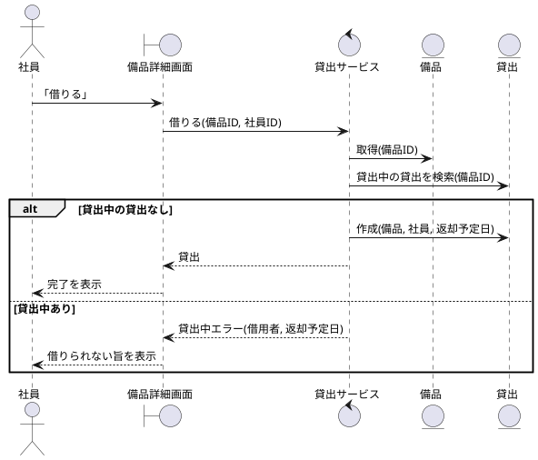

```plantuml シーケンス図
@startuml
skinparam defaultFontSize 12
actor 社員
boundary 備品詳細画面 as ui
control 貸出サービス as svc
entity 備品 as item
entity 貸出 as loan
社員 -> ui : 「借りる」
ui -> svc : 借りる(備品ID, 社員ID)
svc -> item : 取得(備品ID)
svc -> loan : 貸出中の貸出を検索(備品ID)
alt 貸出中の貸出なし
  svc -> loan : 作成(備品, 社員, 返却予定日)
  svc --> ui : 貸出
  ui --> 社員 : 完了を表示
else 貸出中あり
  svc --> ui : 貸出中エラー(借用者, 返却予定日)
  ui --> 社員 : 借りられない旨を表示
end
@enduml
```
