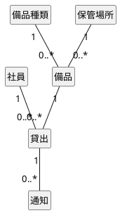

```plantuml 情報
@startuml
hide circle
hide members
skinparam defaultFontSize 13
class 備品
class 備品種類
class 保管場所
class 社員
class 貸出
class 通知
備品種類 "1" -- "0..*" 備品
保管場所 "1" -- "0..*" 備品
備品 "1" -- "0..*" 貸出
社員 "1" -- "0..*" 貸出
貸出 "1" -- "0..*" 通知
@enduml
```

## メモ

- 「個体管理か数量管理か」で以降の画面・データが大きく変わるため最優先で確認する。
- 名詞を増やしたくなったら、画面や表から足さず、ここに戻る。
