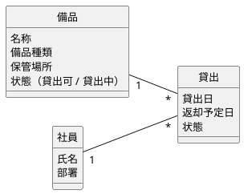

情報モデルの名詞が正本。ユーザーが操作しないものはオブジェクトにしない（通知は対象外）。

## 名詞の洗い出し → オブジェクト

| 名詞（要求・業務フローから） | オブジェクト化 | 理由 |
|---|---|---|
| 備品、プロジェクター、ノートPC | **備品** | ユーザーが探し・選ぶ主対象 |
| 貸出、借りている物 | **貸出** | 一覧で見る・返却する対象 |
| 社員、借用者 | **社員** | 総務担当が「誰が」を見る |
| 保管場所、棚 | 備品の属性 | 単独で操作しない（要確認） |
| 返却予定日、期限 | 貸出の属性 | |
| 通知 | 対象外 | ユーザーが操作しない |

