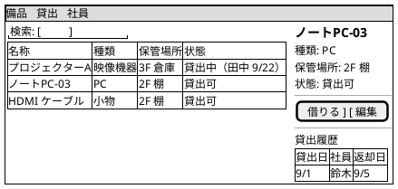
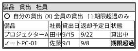

## 備品：コレクション → シングル

## 貸出：コレクション（自分の貸出／全員の貸出）

## ビューの構成

| オブジェクト | コレクション | シングル | 呼び出し元 |
|---|---|---|---|
| 備品 | 備品一覧（検索・絞込） | 備品詳細（貸出履歴つき） | ナビ / 貸出一覧の備品名 |
| 貸出 | 貸出一覧（自分／全員／超過） | 貸出詳細 | ナビ / 備品詳細 |
| 社員 | 社員一覧（総務のみ） | 社員詳細（貸出中一覧） | 貸出一覧の社員名 |
