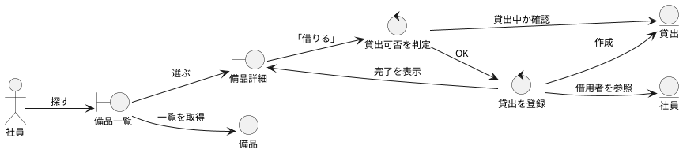
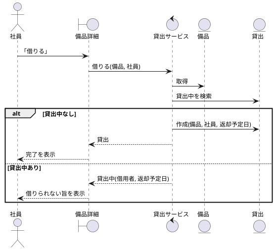

ユースケース記述の画面名・情報名がすべて下の図にあるか、操作が動詞になっているかを見る。

```plantuml 接点の確認（備品を借りる）
@startuml
left to right direction
skinparam defaultFontSize 12
actor 社員
boundary 備品一覧
boundary 備品詳細
control 貸出可否を判定
control 貸出を登録
entity 備品
entity 貸出
entity 社員 as emp
社員 --> 備品一覧 : 探す
備品一覧 --> 備品 : 一覧を取得
備品一覧 --> 備品詳細 : 選ぶ
備品詳細 --> 貸出可否を判定 : 「借りる」
貸出可否を判定 --> 貸出 : 貸出中か確認
貸出可否を判定 --> 貸出を登録 : OK
貸出を登録 --> 貸出 : 作成
貸出を登録 --> emp : 借用者を参照
貸出を登録 --> 備品詳細 : 完了を表示
@enduml
```

判定と登録を、どの情報に対する操作として担わせるか。

```plantuml 処理の順（備品を借りる）
@startuml
skinparam defaultFontSize 12
actor 社員
boundary 備品詳細 as ui
control 貸出サービス as svc
entity 備品 as item
entity 貸出 as loan
社員 -> ui : 「借りる」
ui -> svc : 借りる(備品, 社員)
svc -> item : 取得
svc -> loan : 貸出中を検索
alt 貸出中なし
  svc -> loan : 作成(備品, 社員, 返却予定日)
  svc --> ui : 貸出
  ui --> 社員 : 完了を表示
else 貸出中あり
  svc --> ui : 貸出中(借用者, 返却予定日)
  ui --> 社員 : 借りられない旨を表示
end
@enduml
```
