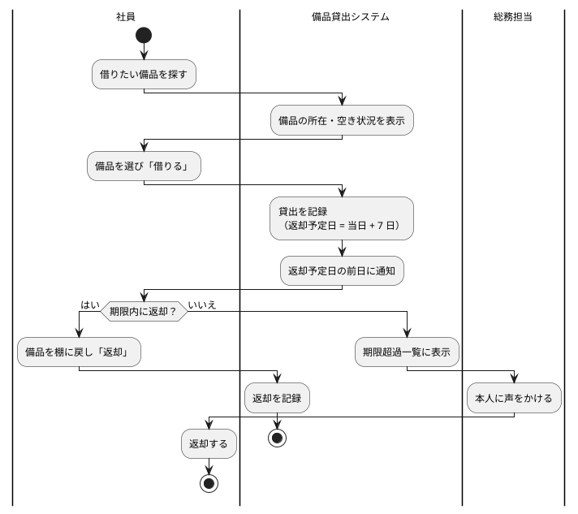

```plantuml 業務フロー（To-Be）
@startuml
skinparam defaultFontSize 12
|社員|
start
:借りたい備品を探す;
|備品貸出システム|
:備品の所在・空き状況を表示;
|社員|
:備品を選び「借りる」;
|備品貸出システム|
:貸出を記録\n（返却予定日 = 当日 + 7 日）;
:返却予定日の前日に通知;
|社員|
if (期限内に返却？) then (はい)
  :備品を棚に戻し「返却」;
  |備品貸出システム|
  :返却を記録;
  stop
else (いいえ)
  |備品貸出システム|
  :期限超過一覧に表示;
  |総務担当|
  :本人に声をかける;
  |社員|
  :返却する;
  stop
endif
@enduml
```

## 利用シーンとして残すこと

- 「月曜朝の未返却確認」は価値デザインのストーリーと対応する主要シーン。
