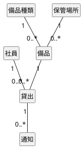

```plantuml 情報モデル
@startuml
hide circle
hide members
skinparam defaultFontSize 13
class 備品
class 備品種類
class 保管場所
class 社員
class 貸出
class 通知
備品種類 "1" -- "0..*" 備品
保管場所 "1" -- "0..*" 備品
備品 "1" -- "0..*" 貸出
社員 "1" -- "0..*" 貸出
貸出 "1" -- "0..*" 通知
@enduml
```

## メモ

- 「個体管理か数量管理か」で情報モデルが大きく変わるため最優先で確認する。
- ここが名詞の正本。ICONIX のドメインモデル、TM の資源／事象、OOUI のオブジェクトは、ここで立てた名前を使う。増やしたくなったらここに戻る。
