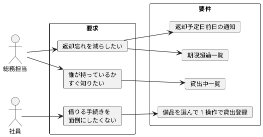

```plantuml 要求モデル
@startuml
left to right direction
skinparam defaultFontSize 12
actor 総務担当
actor 社員
rectangle "要求" {
  card "返却忘れを減らしたい" as r1
  card "誰が持っているか\nすぐ知りたい" as r2
  card "借りる手続きを\n面倒にしたくない" as r3
}
rectangle "要件" {
  card "返却予定日前日の通知" as q1
  card "期限超過一覧" as q2
  card "貸出中一覧" as q3
  card "備品を選んで 1 操作で貸出登録" as q4
}
総務担当 --> r1
総務担当 --> r2
社員 --> r3
r1 --> q1
r1 --> q2
r2 --> q3
r3 --> q4
@enduml
```
