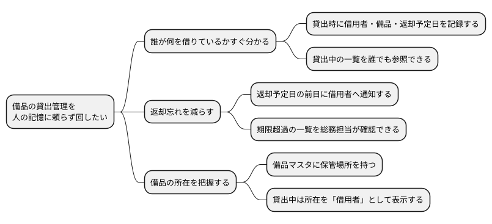
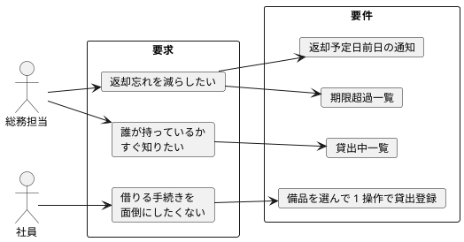

価値の理念を根にして、要求（何をしたいか）と要件（システムとして何をするか）に分解する。

```plantuml 要求の分解
@startmindmap
skinparam defaultFontSize 13
* 備品の貸出管理を\n人の記憶に頼らず回したい
** 誰が何を借りているかすぐ分かる
*** 貸出時に借用者・備品・返却予定日を記録する
*** 貸出中の一覧を誰でも参照できる
** 返却忘れを減らす
*** 返却予定日の前日に借用者へ通知する
*** 期限超過の一覧を総務担当が確認できる
** 備品の所在を把握する
*** 備品マスタに保管場所を持つ
*** 貸出中は所在を「借用者」として表示する
@endmindmap
```

誰の要求で、どの要件がそれを満たすか。

```plantuml 誰の要求か
@startuml
left to right direction
skinparam defaultFontSize 12
actor 総務担当
actor 社員
rectangle "要求" {
  card "返却忘れを減らしたい" as r1
  card "誰が持っているか\nすぐ知りたい" as r2
  card "借りる手続きを\n面倒にしたくない" as r3
}
rectangle "要件" {
  card "返却予定日前日の通知" as q1
  card "期限超過一覧" as q2
  card "貸出中一覧" as q3
  card "備品を選んで 1 操作で貸出登録" as q4
}
総務担当 --> r1
総務担当 --> r2
社員 --> r3
r1 --> q1
r1 --> q2
r2 --> q3
r3 --> q4
@enduml
```
