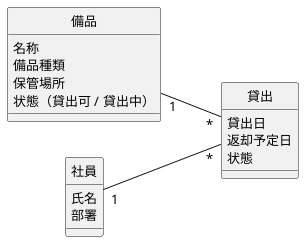
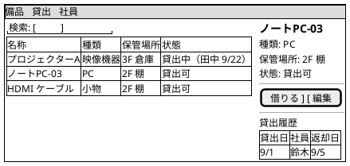
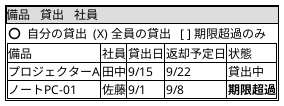

情報の名詞が正本。ユーザーが操作しないものはオブジェクトにしない。

| 名詞（情報から） | オブジェクト化 | 理由 |
|---|---|---|
| 備品、プロジェクター、ノートPC | **備品** | ユーザーが探し・選ぶ主対象 |
| 貸出、借りている物 | **貸出** | 一覧で見る・返却する対象 |
| 社員、借用者 | **社員** | 総務担当が「誰が」を見る |
| 保管場所、棚 | 備品の属性 | 単独で操作しない（要確認） |
| 返却予定日、期限 | 貸出の属性 | |
| 通知 | 対象外 | ユーザーが操作しない |

## 備品：コレクション → シングル

## 貸出：コレクション

## ビューとアクション

| オブジェクト | コレクション | シングル | 呼び出し元 |
|---|---|---|---|
| 備品 | 備品一覧（検索・絞込） | 備品詳細（貸出履歴つき） | ナビ / 貸出一覧の備品名 |
| 貸出 | 貸出一覧（自分／全員／超過） | 貸出詳細 | ナビ / 備品詳細 |
| 社員 | 社員一覧（総務のみ） | 社員詳細（貸出中一覧） | 貸出一覧の社員名 |

| オブジェクト | アクション | 誰が | どのビューで | 備考 |
|---|---|---|---|---|
| 備品 | 借りる | 社員 | シングル | 状態が「貸出可」のときのみ |
| 備品 | 登録 / 編集 / 廃棄 | 総務担当 | コレクション / シングル | |
| 貸出 | 返す | 社員（借用者本人）、総務担当 | シングル / コレクション行 | |
| 貸出 | 延長する | 要確認 | シングル | 上限 14 日（仮） |
| 貸出 | 催促する | 総務担当 | コレクション（期限超過） | 通知を再送 |
| 社員 | 貸出中を見る | 総務担当 | シングル | |

アクションは「オブジェクトを選んでから動詞」。処理は、このビュー名を接点にしてユースケースの動きを検証する。
