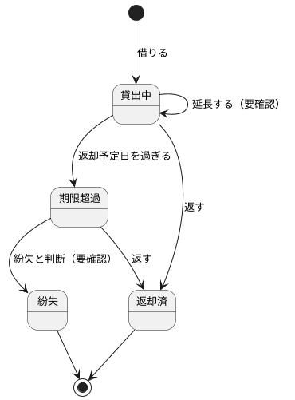

```plantuml 貸出の状態
@startuml
skinparam defaultFontSize 13
[*] --> 貸出中 : 借りる
貸出中 --> 貸出中 : 延長する（要確認）
貸出中 --> 期限超過 : 返却予定日を過ぎる
貸出中 --> 返却済 : 返す
期限超過 --> 返却済 : 返す
期限超過 --> 紛失 : 紛失と判断（要確認）
返却済 --> [*]
紛失 --> [*]
@enduml
```

遷移の名前（借りる／返す／延長する）が、画面のアクションと処理の操作になる。
