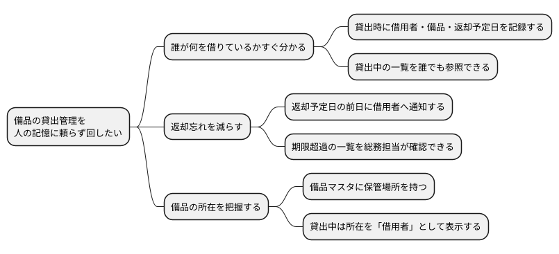

```plantuml 要求分析ツリー
@startmindmap
skinparam defaultFontSize 13
* 備品の貸出管理を\n人の記憶に頼らず回したい
** 誰が何を借りているかすぐ分かる
*** 貸出時に借用者・備品・返却予定日を記録する
*** 貸出中の一覧を誰でも参照できる
** 返却忘れを減らす
*** 返却予定日の前日に借用者へ通知する
*** 期限超過の一覧を総務担当が確認できる
** 備品の所在を把握する
*** 備品マスタに保管場所を持つ
*** 貸出中は所在を「借用者」として表示する
@endmindmap
```

## 読み方

- 1 段目: 価値デザインの理念（なぜ）
- 2 段目: 要求（何を実現したいか）
- 3 段目: 要件（システムとして何をするか）。RDRA の要求モデルへ引き継ぐ。
