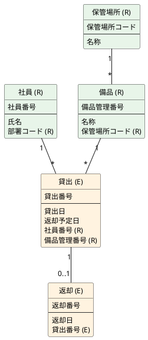

## 記法メモ

- 上段が認知番号（識別子）、下段が属性。資源の識別子が事象に置かれる（再帰的な関係）。
- 資源同士の関係は対照表、事象同士は先行事象の識別子を後続へ置く。
- 情報モデルの「備品種類」は、種類コードという認知番号が確認できるまで備品の属性に留める。
- 情報モデルの「通知」は催促の再送であり、通知番号を採番しなければ事象にしない。状態変化の記録は「貸出」「返却」で足りる。
