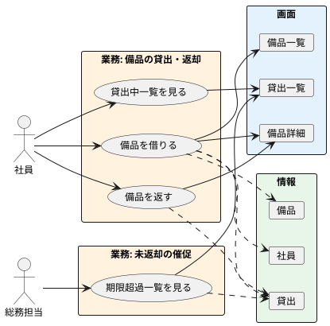

```plantuml ユースケース全体
@startuml
left to right direction
skinparam defaultFontSize 12
actor 社員
actor 総務担当
rectangle "業務: 備品の貸出・返却" #FFF3E0 {
  usecase "備品を借りる" as uc1
  usecase "備品を返す" as uc2
  usecase "貸出中一覧を見る" as uc3
}
rectangle "業務: 未返却の催促" #FFF3E0 {
  usecase "期限超過一覧を見る" as uc4
}
rectangle "画面" #E3F2FD {
  card "備品一覧" as s1
  card "備品詳細" as s2
  card "貸出一覧" as s3
}
rectangle "情報" #E8F5E9 {
  card "備品" as i1
  card "貸出" as i2
  card "社員" as i3
}
社員 --> uc1
社員 --> uc2
社員 --> uc3
総務担当 --> uc4
uc1 --> s1
uc1 --> s2
uc2 --> s2
uc3 --> s3
uc4 --> s3
uc1 ..> i1
uc1 ..> i2
uc1 ..> i3
uc2 ..> i2
uc4 ..> i2
@enduml
```

画面名は「画面」へ、情報名は「情報」へ揃える。個別のやりとりはユースケースごとに書く。
