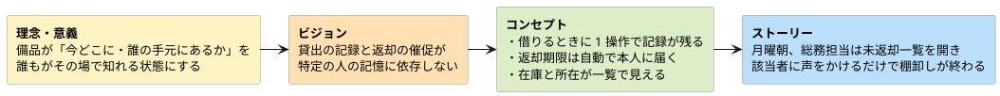
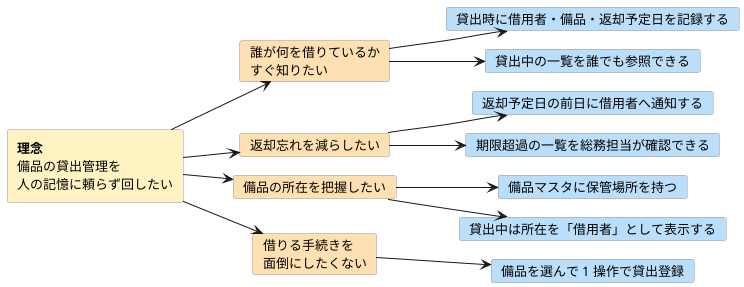

## 価値：なぜ作るか

```plantuml なぜ作るか
@startuml
skinparam defaultFontSize 13
skinparam rectangleBorderColor #999
skinparam nodesep 30
rectangle "<b>理念・意義</b>\n備品が「今どこに・誰の手元にあるか」を\n誰もがその場で知れる状態にする" as p #FFF3C4
rectangle "<b>ビジョン</b>\n貸出の記録と返却の催促が\n特定の人の記憶に依存しない" as v #FFE0B2
rectangle "<b>コンセプト</b>\n・借りるときに 1 操作で記録が残る\n・返却期限は自動で本人に届く\n・在庫と所在が一覧で見える" as c #DCEDC8
rectangle "<b>ストーリー</b>\n月曜朝、総務担当は未返却一覧を開き\n該当者に声をかけるだけで棚卸しが終わる" as s #BBDEFB
p -right-> v
v -right-> c
c -right-> s
@enduml
```

## 価値の補足

- 「意義」はお客様の言葉をなるべくそのまま使う。言い換えた箇所は確認事項に残す。
- ストーリーは代表的な 1 シーンに絞る。複数ある場合は業務の流れへ足す。

## 要求：何を実現するか

理念（黄）を、何をしたいか（橙）、そのためにシステムが何をするか（青）に分解する。誰の要求かは、コンテキストとユースケースで扱う。

```plantuml 要求の分解
@startuml
left to right direction
skinparam defaultFontSize 13
skinparam rectangleBorderColor #999
skinparam cardBorderColor #999
skinparam nodesep 18
skinparam ranksep 50

rectangle "<b>理念</b>\n備品の貸出管理を\n人の記憶に頼らず回したい" as root #FFF3C4

card "誰が何を借りているか\nすぐ知りたい" as r1 #FFE0B2
card "返却忘れを減らしたい" as r2 #FFE0B2
card "備品の所在を把握したい" as r3 #FFE0B2
card "借りる手続きを\n面倒にしたくない" as r4 #FFE0B2

card "貸出時に借用者・備品・返却予定日を記録する" as q1 #BBDEFB
card "貸出中の一覧を誰でも参照できる" as q2 #BBDEFB
card "返却予定日の前日に借用者へ通知する" as q3 #BBDEFB
card "期限超過の一覧を総務担当が確認できる" as q4 #BBDEFB
card "備品マスタに保管場所を持つ" as q5 #BBDEFB
card "貸出中は所在を「借用者」として表示する" as q6 #BBDEFB
card "備品を選んで 1 操作で貸出登録" as q7 #BBDEFB

root --> r1
root --> r2
root --> r3
root --> r4
r1 --> q1
r1 --> q2
r2 --> q3
r2 --> q4
r3 --> q5
r3 --> q6
r4 --> q7
@enduml
```
