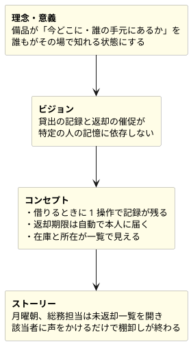

```plantuml 価値
@startuml
skinparam rectangleBackgroundColor #FFFDE7
skinparam rectangleBorderColor #999
skinparam defaultFontSize 13
rectangle "<b>理念・意義</b>\n備品が「今どこに・誰の手元にあるか」を\n誰もがその場で知れる状態にする" as p
rectangle "<b>ビジョン</b>\n貸出の記録と返却の催促が\n特定の人の記憶に依存しない" as v
rectangle "<b>コンセプト</b>\n・借りるときに 1 操作で記録が残る\n・返却期限は自動で本人に届く\n・在庫と所在が一覧で見える" as c
rectangle "<b>ストーリー</b>\n月曜朝、総務担当は未返却一覧を開き\n該当者に声をかけるだけで棚卸しが終わる" as s
p -down-> v
v -down-> c
c -down-> s
@enduml
```

## 補足

- 「意義」はお客様の言葉をなるべくそのまま使う。言い換えた箇所は確認事項に残す。
- ストーリーは代表的な 1 シーンに絞る。複数ある場合は業務の流れへ足す。
